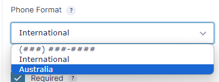

# WP Gravity Forms Spam Filter

Places spam filters into Wordpress to only allow Australian mobile and landline numbers (04, 02, 03, 07, 08)

## Installation into a Bedrock site

#### Install

```
# 1. Get it ready (to use a repo outside of packagist)
composer config repositories.wp-gf-spam-filter git https://github.com/pvtl/wp-gf-spam-filter

# 2. Install the Plugin
composer require pvtl/wp-gf-spam-filter
```

#### Activate / Configure

- Activate the plugin
- When creating the gravity form, ensure that the phone number format is set to Australia, not international.


